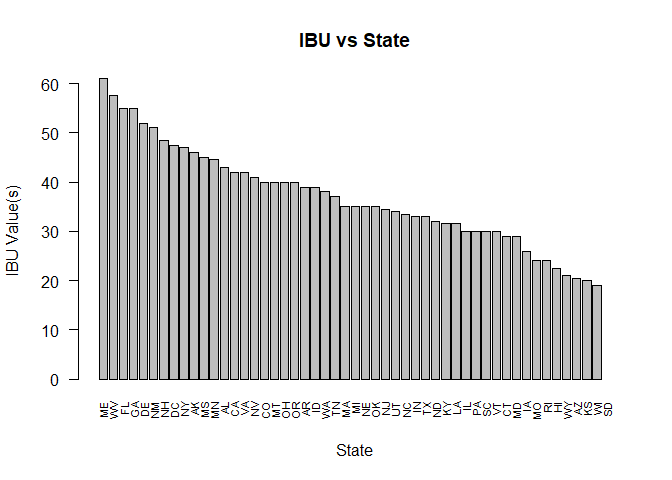
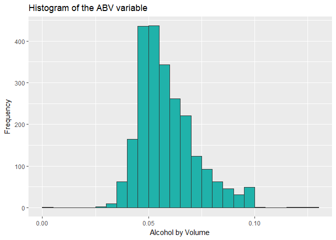

# Craft Beer Market Analysis
###*Presented to the Brewers Association in Boulder, CO*

## **Section 1** Introduction

### The beer market in the U.S.

According to the Brewers Association, the overall beer market size in the U.S. was USD 111.4 Billion in 2017, of which USD 26 Billion belong to "craft beers". Retail dollar sales of craft increased 8%, a much larger growth than the rest of the industry. 

In volume terms, Overall U.S. beer volume sales were down 1% in 2017, whereas craft brewer sales continued to grow at a rate of 5% by volume, reaching 12.7% of the U.S. beer market by volume. Craft production grew the most for microbreweries.

We can therefore conclude that there is a surge in popularity of craft beers in the United States, produced by smaller companies. In contrast with the older and larger breweries that mostly produce lager beer, craft beer producers offer a wide variety of styles. Their manufacturing practices and quality of their products make these breweries more attractive to current consumers.

### Craft Breweries

The craft brewer definition is: An American craft brewer is small, independent, and traditional.

* Small: Annual production of 6 million barrels of beer or less (approximately 3 percent of U.S. annual sales). Beer production is attributed to a brewer according to the rules of alternating proprietorships.

* Independent: Less than 25 percent of the craft brewery is owned or controlled (or equivalent economic interest) by a beverage alcohol industry member which is not itself a craft brewer.

* Traditional: A brewer which has a majority of its total beverage alcohol volume in beers whose flavors derive from traditional or innovative brewing ingredients and their fermentation. Flavored Malt Beverages (FMBs) are not considered beers.

Due to the small size and explosive growth of craft breweries, the total number of breweries rose from 42 in 1978 to over 2,750 in 2012. This also produces a large amount of data, suitable to be analyzed with Data Science tools and techniques.For this analysis, we use a database with information about 2,410 different beers manufactured by more than 550 producers in the U.S. 

## **Section 2** Preparatory Steps


```r
#Rene's working directory
setwd("E:/Bibliotecas/Documents/Data Science/SMU/MSDS 6306 Doing Data Science/Craft Beer Analysis")

#Mahesh's working directory
#setwd("E:/Mahesh/SMU/MSDS6306 Doing Data Science/Homework/Craft-Beer-Analysis")

#Chaoshun's working directory
#setwd("C:/Users/chux/Downloads/study1/study1")
#setwd("/Users/chux/Desktop/datascience/Homework/Doing_Data_Science/study1")
#Set up your working directory here

#Load additional packages
library(dplyr)
library(ggplot2)
library(ggmap)
library(maps)
library(mapdata)
library(dplyr)
library(tm)
library(SnowballC)
library(wordcloud)
library(RColorBrewer)
library(car)
      
# Load the datasets
Beers <- read.csv("Beers.csv", header = TRUE)
Breweries <- read.csv("Breweries.csv", header = TRUE)

# Inspect and understand the structure of the datasets
str(Beers)
```

```
## 'data.frame':	2410 obs. of  7 variables:
##  $ Name      : Factor w/ 2305 levels "#001 Golden Amber Lager",..: 1638 577 1705 1842 1819 268 1160 758 1093 486 ...
##  $ Beer_ID   : int  1436 2265 2264 2263 2262 2261 2260 2259 2258 2131 ...
##  $ ABV       : num  0.05 0.066 0.071 0.09 0.075 0.077 0.045 0.065 0.055 0.086 ...
##  $ IBU       : int  NA NA NA NA NA NA NA NA NA NA ...
##  $ Brewery_id: int  409 178 178 178 178 178 178 178 178 178 ...
##  $ Style     : Factor w/ 100 levels "","Abbey Single Ale",..: 19 18 16 12 16 80 18 22 18 12 ...
##  $ Ounces    : num  12 12 12 12 12 12 12 12 12 12 ...
```

```r
summary(Beers[,c(3,4,7)])
```

```
##       ABV               IBU             Ounces     
##  Min.   :0.00100   Min.   :  4.00   Min.   : 8.40  
##  1st Qu.:0.05000   1st Qu.: 21.00   1st Qu.:12.00  
##  Median :0.05600   Median : 35.00   Median :12.00  
##  Mean   :0.05977   Mean   : 42.71   Mean   :13.59  
##  3rd Qu.:0.06700   3rd Qu.: 64.00   3rd Qu.:16.00  
##  Max.   :0.12800   Max.   :138.00   Max.   :32.00  
##  NA's   :62        NA's   :1005
```

```r
str(Breweries)
```

```
## 'data.frame':	558 obs. of  4 variables:
##  $ Brew_ID: int  1 2 3 4 5 6 7 8 9 10 ...
##  $ Name   : Factor w/ 551 levels "10 Barrel Brewing Company",..: 355 12 266 319 201 136 227 477 59 491 ...
##  $ City   : Factor w/ 384 levels "Abingdon","Abita Springs",..: 228 200 122 299 300 62 91 48 152 136 ...
##  $ State  : Factor w/ 51 levels " AK"," AL"," AR",..: 24 18 20 5 5 41 6 23 23 23 ...
```
## **Section 3 Questions**

### Question 1. How many breweries are present in each State?

```r
table(Breweries$State, useNA = "no")
```

```
## 
##  AK  AL  AR  AZ  CA  CO  CT  DC  DE  FL  GA  HI  IA  ID  IL  IN  KS  KY 
##   7   3   2  11  39  47   8   1   2  15   7   4   5   5  18  22   3   4 
##  LA  MA  MD  ME  MI  MN  MO  MS  MT  NC  ND  NE  NH  NJ  NM  NV  NY  OH 
##   5  23   7   9  32  12   9   2   9  19   1   5   3   3   4   2  16  15 
##  OK  OR  PA  RI  SC  SD  TN  TX  UT  VA  VT  WA  WI  WV  WY 
##   6  29  25   5   4   1   3  28   4  16  10  23  20   1   4
```
#### The distribution of breweries in each State can be seen in the following table:

State|Number of Breweries
-----|-------------------
AK   |7 
AL   |3
AR   |2
AZ   |11
CA   |39
CO   |47
CT   |8
DC   |1
DE   |2
FL   |15
GA   |7
HI   |4
IA   |5
ID   |5
IL   |18
IN   |22
KS   |3
KY   |4
LA   |5
MA   |23
MD   |7
ME   |9
MI   |32
MN   |12
MO   |9
MS   |2
MT   |9
NC   |19
ND   |1
NE   |5
NH   |3
NJ   |3
NM   |4
NV   |2
NY   |16
OH   |15
OK   |6
OR   |29
PA   |25
RI   |5
SC   |4
SD   |1
TN   |3
TX   |28
UT   |4
VA   |16
VT   |10
WA   |23
WI   |20
WV   |1
WY   |4

We'll create a heat map to analyze in which States craft breweries are more popular

```r
#Use map data
usa <- map_data("usa")
states <- map_data("state")
#Create Table
BreweriesState <- as.data.frame(table(Breweries$State, useNA = "no"))

#Eliminate HI and AK observations
BreweriesState <- BreweriesState[c(2:11,13:51),]
#Reordering the observations to match State names in the table
BreweriesState <- BreweriesState[(c(1,3,2,4:6,8,7,9:10,12,13,14,11,15:17,20,19,18,21:22,24,23,25,28,32,29,30,31,33,26,27,34:43,45,44,46,48,47,49)),]
#Create table with State Names
StateNames <- unique(states$region)
#Join the tables
BreweriesState <- cbind(BreweriesState, StateNames)
names(BreweriesState) <- c("State.abb", "Number.of.Breweries", "region")
BreweriesState.map <- inner_join(states, BreweriesState, by = "region")
#Create the map
ggplot(data = BreweriesState.map) +
  geom_polygon(aes(x = long, y = lat, fill = Number.of.Breweries, group = group), color = "black") +
  coord_fixed(1.3) +
  scale_fill_gradientn(colours=rev(heat.colors(10)),na.value="grey90")
```

<!-- -->

### Question 2. Merge beer data with the breweries data. Print the first 6 observations and the last six observations to check the merged file.


```r
# There is one "Name" variable in each dataset. Change Variable names to distinguish between Beer and Brewery names
# Each dataset have different Brewery ID variable name. Change to Brewery_ID to match both datasets:
Breweries <- rename(Breweries, Brewery_ID = Brew_ID, Brewery_Name = Name )
Beers <- rename(Beers, Brewery_ID = Brewery_id, Beer_Name = Name)

#Order the data by Brewery and Beer_ID (not necessary because we are using the merge command, but useful anyway)
Beers <- Beers[order(Beers$Brewery_ID,Beers$Beer_ID),]

#Merge the datasets by Brewery_ID
MergedBeers <- merge(x = Beers, y = Breweries, by = "Brewery_ID", all = TRUE)

### Print the first 6 observations and the last six observations to check the merged file.
head(MergedBeers, 6)
```

```
##   Brewery_ID     Beer_Name Beer_ID   ABV IBU
## 1          1   Parapet ESB    2687 0.056  47
## 2          1    Stronghold    2688 0.060  25
## 3          1       Pumpion    2689 0.060  38
## 4          1    Wall's End    2690 0.048  19
## 5          1 Maggie's Leap    2691 0.049  26
## 6          1  Get Together    2692 0.045  50
##                                 Style Ounces       Brewery_Name
## 1 Extra Special / Strong Bitter (ESB)     16 NorthGate Brewing 
## 2                     American Porter     16 NorthGate Brewing 
## 3                         Pumpkin Ale     16 NorthGate Brewing 
## 4                   English Brown Ale     16 NorthGate Brewing 
## 5                  Milk / Sweet Stout     16 NorthGate Brewing 
## 6                        American IPA     16 NorthGate Brewing 
##          City State
## 1 Minneapolis    MN
## 2 Minneapolis    MN
## 3 Minneapolis    MN
## 4 Minneapolis    MN
## 5 Minneapolis    MN
## 6 Minneapolis    MN
```

```r
tail(MergedBeers, 6)
```

```
##      Brewery_ID                 Beer_Name Beer_ID   ABV IBU
## 2405        556             Pilsner Ukiah      98 0.055  NA
## 2406        557         Porkslap Pale Ale      49 0.043  NA
## 2407        557         Moo Thunder Stout      50 0.049  NA
## 2408        557           Snapperhead IPA      51 0.068  NA
## 2409        557  Heinnieweisse Weissebier      52 0.049  NA
## 2410        558 Urban Wilderness Pale Ale      30 0.049  NA
##                        Style Ounces                  Brewery_Name
## 2405         German Pilsener     12         Ukiah Brewing Company
## 2406 American Pale Ale (APA)     12       Butternuts Beer and Ale
## 2407      Milk / Sweet Stout     12       Butternuts Beer and Ale
## 2408            American IPA     12       Butternuts Beer and Ale
## 2409              Hefeweizen     12       Butternuts Beer and Ale
## 2410        English Pale Ale     12 Sleeping Lady Brewing Company
##               City State
## 2405         Ukiah    CA
## 2406 Garrattsville    NY
## 2407 Garrattsville    NY
## 2408 Garrattsville    NY
## 2409 Garrattsville    NY
## 2410     Anchorage    AK
```

### Question 3. Report the number of NA's in each column.

```r
sapply(MergedBeers, function(y) sum(is.na(y)))
```

```
##   Brewery_ID    Beer_Name      Beer_ID          ABV          IBU 
##            0            0            0           62         1005 
##        Style       Ounces Brewery_Name         City        State 
##            0            0            0            0            0
```
#### Two columns have NA's: ABV has 62 and IBU has 1005, out of 2410 total rows

### Question 4. Compute the median alcohol content and international bitterness unit for each state. Plot a bar chart to compare.


```r
## First do not select data with NA as their mean would be NA then so use split MergedBeers on state and
## get the mean of the split values with na.rm = TRUE
ABV.median <- sapply(split(MergedBeers, MergedBeers$State), function(y) median(y$ABV, na.rm = TRUE))
IBU.median <- sapply(split(MergedBeers, MergedBeers$State), function(y) median(y$IBU, na.rm = TRUE))

## Sort it in descending order
ABV.median.sort <- ABV.median[order(-ABV.median)]
IBU.median.sort <- IBU.median[order(-IBU.median)]

##plot a bar chart to compare
##Barplot of ABV value(s) vs State
barplot(ABV.median.sort, main="ABV vs State", xlab="State", ylab="ABV Value(s)", las=2, cex.names = 0.7)
```

<!-- -->

```r
##Barplot of IBU value(s) vs State
barplot(IBU.median.sort, main="IBU vs State", xlab="State", ylab="IBU Value(s)", las=2, cex.names = 0.7)
```

<!-- -->

### Question 5. Which state has the maximum alcoholic (ABV) beer? Which state has the most bitter (IBU) beer?
 

```r
##State with maximum alcoholic (ABV) beer
MergedBeers[which(MergedBeers$ABV == max(MergedBeers$ABV, na.rm=T)),]
```

```
##     Brewery_ID                                            Beer_Name
## 392         52 Lee Hill Series Vol. 5 - Belgian Style Quadrupel Ale
##     Beer_ID   ABV IBU            Style Ounces            Brewery_Name
## 392    2565 0.128  NA Quadrupel (Quad)   19.2 Upslope Brewing Company
##        City State
## 392 Boulder    CO
```

```r
## State with maximum alcoholic (IBU) beer
MergedBeers[which(MergedBeers$IBU == max(MergedBeers$IBU, na.rm=T)),]
```

```
##      Brewery_ID                 Beer_Name Beer_ID   ABV IBU
## 1858        375 Bitter Bitch Imperial IPA     980 0.082 138
##                               Style Ounces            Brewery_Name    City
## 1858 American Double / Imperial IPA     12 Astoria Brewing Company Astoria
##      State
## 1858    OR
```
#### The State that has maximum alcoholic (ABV) beer is CO, and it's the "Lee Hill Series Vol. 5", a Quadrupel Ale with 0.128 ABV
#### The State that has most bitter (IBU) beer is OR, and it's the "Bitter Bitch", an Imperial IPA with 138 IBU.

### Question 6. Summary statistics for the ABV variable.


```r
## Summary statistics for the ABV variable of the merged dataset
summary(MergedBeers$ABV)
```

```
##    Min. 1st Qu.  Median    Mean 3rd Qu.    Max.    NA's 
## 0.00100 0.05000 0.05600 0.05977 0.06700 0.12800      62
```

```r
sd(MergedBeers$ABV, na.rm = TRUE )
```

```
## [1] 0.01354173
```

```r
ggplot(data=MergedBeers, aes(MergedBeers$ABV)) + 
  geom_histogram(breaks=seq(0,0.13, by=0.005),col="gray20", fill="lightseagreen") + 
  labs(title="Histogram of the ABV variable") +
  labs(x="Alcohol by Volume", y="Frequency")
```

<!-- -->

### 7. Is there an apparent relationship between the bitterness of the beer and its alcoholic content? Draw a scatter plot.


```r
##Scatter plot between bitterness of beer and its alcoholic content
plot(IBU~ABV, data=MergedBeers, main = "Relationship between Bitterness (IBU) and alcoholic content (ABV)")
abline(lm(IBU~ABV, data=MergedBeers), col="red")
```

<!-- -->

```r
cor(MergedBeers$IBU, MergedBeers$ABV, use = "pairwise.complete.obs")
```

```
## [1] 0.6706215
```
#### Looking at the scatterplot, there seems to be an apparent relationship between the bitterness of the beer and its alcoholic content.Additionally, we have fitted a regression line to show the positive relationship. Additionally, we've calculated the correlation between bitternes and alcoholic content, resulting in a value of 0.67. This is all evidence in favor of a positive relationship betwen the variables. 

### Additional analysis

#### Additional Analysis 1. Which styles of beer are more popular?
We'll create a barplot with the most popular beer styles:

```r
# Create and sort the data
StyleFreqTable <- as.data.frame(table(Beers$Style))
StyleFreqTable <- StyleFreqTable[order(-StyleFreqTable$Freq),]
names(StyleFreqTable) <- c("Style", "Frequency")
# Plot the data
ggplot(data = StyleFreqTable[1:20,], aes(x = reorder(Style, -Frequency), y = Frequency)) +
  geom_bar(aes(fill = Style), stat = "identity", fill = "lightblue", color = "black") +
  labs(title = "Most popular Styles of Beer", x = "Style of Beer", y = "Frequency") +
  theme(axis.text.x = element_text(angle = 90, hjust = 1))
```

<!-- -->


#### Additional analysis 2. What words are more common in Beer names?
We'll create a word cloud to visualize which words are popular for beer names (we've not included the words american, ipa, pale, ale, and lager)


```r
#Create file with the text of the Beer Names
text <- as.character(Beers$Beer_Name)
docs <- Corpus(VectorSource(text))
toSpace <- content_transformer(function (x , pattern ) gsub(pattern, " ", x))
docs <- tm_map(docs, toSpace, "/")

# Convert the text to lower case
docs <- tm_map(docs, content_transformer(tolower))
# specify your stopwords as a character vector
docs <- tm_map(docs, removeWords, c("american","#", "the", "ale", "ipa", "pale", "lager"))
# Remove numbers
docs <- tm_map(docs, removeNumbers)
# Eliminate extra white spaces
docs <- tm_map(docs, stripWhitespace)

dtm <- TermDocumentMatrix(docs)
m <- as.matrix(dtm)
v <- sort(rowSums(m),decreasing=TRUE)
d <- data.frame(word = names(v),freq=v)
#Create Word Cloud
set.seed(1234)
wordcloud(words = d$word, freq = d$freq, min.freq = 10,
          max.words=200, random.order=FALSE, rot.per=0.35, 
          colors=brewer.pal(8, "Dark2"))
```

<!-- -->

## **Section 4 Conclusions**
The primary objective of this work is to provide the Brewers Association with insights that can help to understand the craft beers industry, using sample data from producers in the United States.

In order to accomplish this, we take two different data files which are beer and breweries data, read the data from the a csv file into a data frame, inspect and understand the structure of the data, merge the data frames, and perform some analysis on the final data set.As Data Scientists, it is very rare to work only on a single perfect data set, and thus a large percentage of work will be to gather different datasets, and to clean and merge them before the analysis starts, as illustrated in this work. After preparing the data, statistical inference can then be made to the data. 

Based on the analysis, California and Colorado are the top two States. When we order all the data by Brewery and Beer IDs, . The first six observations include beer names: Parapet ESB, Stronghold, Pumpion, Wall's End, Maggie's Leap and Get Together. The last 6 obervations include beer names: Pilsner Ukiah, Porkslap Pale Ale, Moo Thunder Stout, Snapperhead IPA, Heinnieweisse Weissebier and Urban Wilderness Pale Ale; Out of 2410 total rows of the data, there are two columns having NA's: ABV has 62 and IBU has 1005. 

After computing the median alcohol content and international bitterness unit for each state. DC has the highest median ABV, MS has the highest median IBV; UT has the lowest median ABV, SD has the lowest median IBV. The State of Colorado has the maximum alcoholic (ABV) beer and Oregon has the most bitter(IBU) beer. Afer running the summary statistics to ABV variable, the min ABV is 0.001 and the max ABV is 0.128. The Mean is 0.05977 and the median is 0.056. It has a littble bit skewness here. Based on the scatter plot, we can see that there is a noticeable positive, linear relationship between the bitterness of the beer and the alcoholic content.

