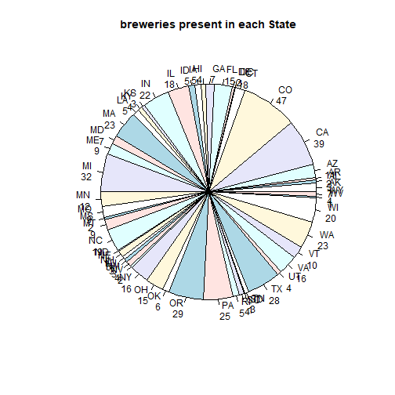
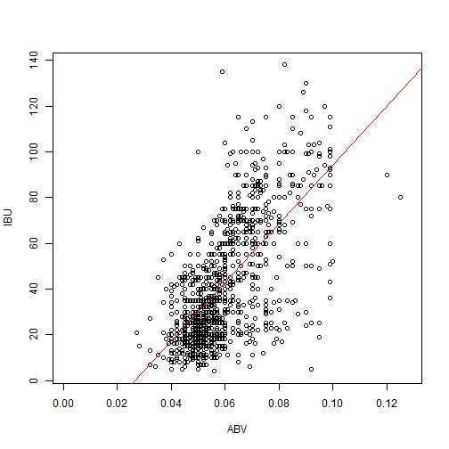
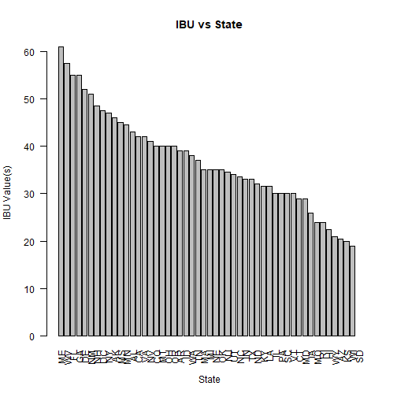

Craft Beer Analysis
========================================================
author: Rene Pineda, Mahesh Kuklani, Chaoshun Hu
date:   June 25, 2018
autosize: true

Introduction
========================================================
- The beer Market in the U.S.

According to the Brewers Association, the overall beer market size in the U.S. was USD 111.4 Billion in 2017, of which USD 26 Billion belong to “craft beers”.

- Craft Breweries

The craft brewer definition is: An American craft brewer is small, independent, and traditional.

Due to the small size and explosive growth of craft breweries, the total number of breweries rose from 42 in 1978 to over 2,750 in 2012.

Preparatory Steps -- load the data
========================================================


```r
#setwd("C:/Users/chux/Downloads/study1/study1")
setwd("/Users/chux/Desktop/datascience/Homework/Doing_Data_Science/study1")
#Load additional packages
library(dplyr)
library(ggplot2)
      
# Load the datasets
Beers <- read.csv("Beers.csv", header = TRUE)
Breweries <- read.csv("Breweries.csv", header = TRUE)
```

Inspect and understand the structure of the datasets (1)
========================================================


```
'data.frame':	2410 obs. of  7 variables:
 $ Name      : Factor w/ 2305 levels "#001 Golden Amber Lager",..: 1638 577 1704 1842 1819 268 1160 758 1093 486 ...
 $ Beer_ID   : int  1436 2265 2264 2263 2262 2261 2260 2259 2258 2131 ...
 $ ABV       : num  0.05 0.066 0.071 0.09 0.075 0.077 0.045 0.065 0.055 0.086 ...
 $ IBU       : int  NA NA NA NA NA NA NA NA NA NA ...
 $ Brewery_id: int  409 178 178 178 178 178 178 178 178 178 ...
 $ Style     : Factor w/ 100 levels "","Abbey Single Ale",..: 19 18 16 12 16 80 18 22 18 12 ...
 $ Ounces    : num  12 12 12 12 12 12 12 12 12 12 ...
```

Inspect and understand the structure of the datasets (2)
========================================================


```
      ABV               IBU             Ounces     
 Min.   :0.00100   Min.   :  4.00   Min.   : 8.40  
 1st Qu.:0.05000   1st Qu.: 21.00   1st Qu.:12.00  
 Median :0.05600   Median : 35.00   Median :12.00  
 Mean   :0.05977   Mean   : 42.71   Mean   :13.59  
 3rd Qu.:0.06700   3rd Qu.: 64.00   3rd Qu.:16.00  
 Max.   :0.12800   Max.   :138.00   Max.   :32.00  
 NA's   :62        NA's   :1005                    
```

Inspect and understand the structure of the datasets (3)
========================================================


```
'data.frame':	558 obs. of  4 variables:
 $ Brew_ID: int  1 2 3 4 5 6 7 8 9 10 ...
 $ Name   : Factor w/ 551 levels "10 Barrel Brewing Company",..: 355 12 266 319 201 136 227 477 59 491 ...
 $ City   : Factor w/ 384 levels "Abingdon","Abita Springs",..: 228 200 122 299 300 62 91 48 152 136 ...
 $ State  : Factor w/ 51 levels " AK"," AL"," AR",..: 24 18 20 5 5 41 6 23 23 23 ...
```


How many breweries are present in each State?
========================================================



```

 AK  AL  AR  AZ  CA  CO  CT  DC  DE  FL  GA  HI  IA  ID  IL  IN  KS  KY 
  7   3   2  11  39  47   8   1   2  15   7   4   5   5  18  22   3   4 
 LA  MA  MD  ME  MI  MN  MO  MS  MT  NC  ND  NE  NH  NJ  NM  NV  NY  OH 
  5  23   7   9  32  12   9   2   9  19   1   5   3   3   4   2  16  15 
 OK  OR  PA  RI  SC  SD  TN  TX  UT  VA  VT  WA  WI  WV  WY 
  6  29  25   5   4   1   3  28   4  16  10  23  20   1   4 
```

Merging beer with breweries data
========================================================


```
'data.frame':	2410 obs. of  10 variables:
 $ Brewery_ID  : int  1 1 1 1 1 1 2 2 2 2 ...
 $ Beer_Name   : Factor w/ 2305 levels "#001 Golden Amber Lager",..: 1525 1926 1640 2185 1258 802 2017 1570 1116 494 ...
 $ Beer_ID     : int  2687 2688 2689 2690 2691 2692 2674 2675 2676 2677 ...
 $ ABV         : num  0.056 0.06 0.06 0.048 0.049 0.045 0.05 0.06 0.065 0.051 ...
 $ IBU         : int  47 25 38 19 26 50 20 65 NA 38 ...
 $ Style       : Factor w/ 100 levels "","Abbey Single Ale",..: 57 22 83 48 77 16 48 16 26 90 ...
 $ Ounces      : num  16 16 16 16 16 16 16 16 16 16 ...
 $ Brewery_Name: Factor w/ 551 levels "10 Barrel Brewing Company",..: 355 355 355 355 355 355 12 12 12 12 ...
 $ City        : Factor w/ 384 levels "Abingdon","Abita Springs",..: 228 228 228 228 228 228 200 200 200 200 ...
 $ State       : Factor w/ 51 levels " AK"," AL"," AR",..: 24 24 24 24 24 24 18 18 18 18 ...
```

the first 6 observations after merging beer with breweries data
========================================================

```
  Brewery_ID     Beer_Name Beer_ID   ABV IBU
1          1   Parapet ESB    2687 0.056  47
2          1    Stronghold    2688 0.060  25
3          1       Pumpion    2689 0.060  38
4          1    Wall's End    2690 0.048  19
5          1 Maggie's Leap    2691 0.049  26
6          1  Get Together    2692 0.045  50
                                Style Ounces       Brewery_Name
1 Extra Special / Strong Bitter (ESB)     16 NorthGate Brewing 
2                     American Porter     16 NorthGate Brewing 
3                         Pumpkin Ale     16 NorthGate Brewing 
4                   English Brown Ale     16 NorthGate Brewing 
5                  Milk / Sweet Stout     16 NorthGate Brewing 
6                        American IPA     16 NorthGate Brewing 
         City State
1 Minneapolis    MN
2 Minneapolis    MN
3 Minneapolis    MN
4 Minneapolis    MN
5 Minneapolis    MN
6 Minneapolis    MN
```

the last 6 observations after merging beer with breweries data
========================================================

```
     Brewery_ID                 Beer_Name Beer_ID   ABV IBU
2405        556             Pilsner Ukiah      98 0.055  NA
2406        557         Porkslap Pale Ale      49 0.043  NA
2407        557         Moo Thunder Stout      50 0.049  NA
2408        557           Snapperhead IPA      51 0.068  NA
2409        557  Heinnieweisse Weissebier      52 0.049  NA
2410        558 Urban Wilderness Pale Ale      30 0.049  NA
                       Style Ounces                  Brewery_Name
2405         German Pilsener     12         Ukiah Brewing Company
2406 American Pale Ale (APA)     12       Butternuts Beer and Ale
2407      Milk / Sweet Stout     12       Butternuts Beer and Ale
2408            American IPA     12       Butternuts Beer and Ale
2409              Hefeweizen     12       Butternuts Beer and Ale
2410        English Pale Ale     12 Sleeping Lady Brewing Company
              City State
2405         Ukiah    CA
2406 Garrattsville    NY
2407 Garrattsville    NY
2408 Garrattsville    NY
2409 Garrattsville    NY
2410     Anchorage    AK
```

Report the number of NA's in each column
========================================================


```
  Brewery_ID    Beer_Name      Beer_ID          ABV          IBU 
           0            0            0           62         1005 
       Style       Ounces Brewery_Name         City        State 
           0            0            0            0            0 
```

Two columns have NA's: 
    
    ABV has 62 and IBU has 1005, out of 2410 total rows

median ABV valus(s) vs States
========================================================


DC has the highest median ABV and UT has the lowest median ABV.

median IBU valus(s) vs States
========================================================


ME has the highest median IBU and SD has the lowest median IBU.

Which state has the maximum alcoholic (ABV) beer? Which state has the most bitter (IBU) beer?
========================================================
Which state has the maximum alcoholic (ABV) beer

```
[1]  CO
51 Levels:  AK  AL  AR  AZ  CA  CO  CT  DC  DE  FL  GA  HI  IA  ID ...  WY
```


Which state has the most bitter (IBU) beer

```
[1]  OR
51 Levels:  AK  AL  AR  AZ  CA  CO  CT  DC  DE  FL  GA  HI  IA  ID ...  WY
```

State that has maximum alcoholic (ABV) beer is CO.


State that has most bitter (IBU) beer is OR.


Summary statistics for the ABV variable.
========================================================

```r
##Sumary statistics for the ABV variable from the Beers dataset
summary(Beers$ABV)
```

```
   Min. 1st Qu.  Median    Mean 3rd Qu.    Max.    NA's 
0.00100 0.05000 0.05600 0.05977 0.06700 0.12800      62 
```

```r
## Summary statistics for the ABV variable of the merged dataset
summary(MergedBeers$ABV)
```

```
   Min. 1st Qu.  Median    Mean 3rd Qu.    Max.    NA's 
0.00100 0.05000 0.05600 0.05977 0.06700 0.12800      62 
```

the bitterness of the beer vs its alcoholic content
========================================================

```r
##Scatter plot between bitterness of beer and its alcoholic content
plot(IBU~ABV, data=MergedBeers)
abline(lm(IBU~ABV, data=MergedBeers), col="red")
```


Conclusion
========================================================

In summary, this primary objective of this work is to take two different data files which are beer and breweries data, read the data from the a csv file into a data frame, inspect and understand the structure of the data, merge the data frames, and perform some analysis on the final data set.

As Data Scientist, it is very rare to work only on a single perfect data and thus a large percentage of work will be accept different datasets, merge different available data sets before processing it as illustrated in this work. After preparing the data, statistical inference can then be made to the data. 

Based on the analysis, California and Colorado are top two which have most breweries. If order the all the data by Brewery and Beer IDs. The first six observations include beer names: Parapet ESB, Stronghold, Pumpion, Wall's End, Maggie's Leap and Get Together. The last 6 obervations include beer names: Pilsner Ukiah, Porkslap Pale Ale, Moo Thunder Stout, Snapperhead IPA, Heinnieweisse Weissebier and Urban Wilderness Pale Ale; Out of 2410 total rows of the data, there are two columns having NA's: ABV has 62 and IBU has 1005. 

After computing the median alcohol content and international bitterness unit for each state. DC has the highest median ABV, MS has the highest median IBV; UT has the lowest median ABV, SD has the lowest median IBV. But Co has the mximum alcoholic (ABV) beer and OR has the most bitter(IBU) beer. Afer running the summary statistics to ABV variable, the min ABV is 0.001 and the max ABV is 0.128. The Mean is 0.05977 and the median is 0.056. It has a littble bit skewness here. Based on the scatter plot, there is no linear relation between the bitterness of the beer and the alcoholic cotent.
